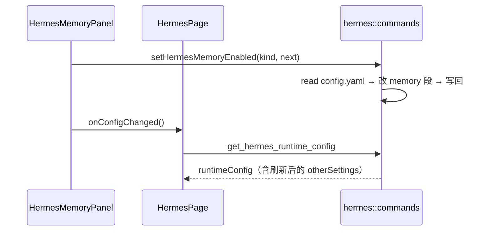

# Hermes 前端模块说明

## 一句话职责

- `hermes/` 页面负责 Hermes Agent 运行时 `config.yaml` 的 custom_providers、模型设置、Memory 面板与通用配置编辑交互。

## Source of Truth

- 页面展示的配置来自当前生效的 Hermes `config.yaml`；`runtimeConfig` 是后端读取结果的镜像，不是主数据。
- `runtimeConfig.otherSettings` 是后端 `build_other_settings()` 过滤掉受保护键（`model`、`custom_providers`、`providers`、`mcp_servers`、`_config_version`）后的切片；通用配置编辑面只拥有这一切片。
- Memory 面板的缓存文件与开关来自后端 `get_hermes_memory_limits()` / `set_hermes_memory_enabled()`，开关落在 `config.yaml` 的 `memory:` 段。

## 核心设计决策（Why）

- 通用配置（其他设置）用 JsonEditor 自动保存：失焦即 `save_hermes_other_settings()`，后端按切片读-改-写，只替换它拥有的顶层键，所以 MCP、provider、模型等键不会被这次保存回退。
- Memory 面板与通用配置编辑面**共同拥有** `memory:` 段（前者写开关，后者以 JSON 文本展示整段），因此面板写完后必须让页面重读配置（`onConfigChanged` → `loadConfig(true)`），否则编辑器的旧文本会在下一次失焦保存里把开关改回去（issue #406 同形）。

## 关键流程

## 易错点与历史坑（Gotchas）

- 给 `HermesMemoryPanel` 加新的写配置动作（例如批量改 budgets）时，成功后同样要调用 `onConfigChanged`，不要只更新面板自己的 `limits`。
- 通用配置编辑面的保存**不能**改成前端拼整份配置落盘：后端的切片读-改-写是 MCP/provider/模型不被回退的唯一保证。
- 新增受保护键时同时改后端 `HERMES_OTHER_SETTINGS_PROTECTED_KEYS` 与 `build_other_settings()`，前端不需要维护第二份名单。

## 跨模块依赖

- 依赖后端 `hermes::commands` 的 runtime config / memory / provider 命令。
- 复用 `shared/` 的根目录弹窗、prompt 面板、favorite provider 与 `shared/configSaveBase` 语义。

## 最小验证

- 改 Memory 面板写配置后：打开本页，切换一个 Memory 开关，再编辑「通用配置」并点击外部失焦，确认 `config.yaml` 的 `memory:` 段保持切换后的值。
- 改通用配置保存链路时：确认 MCP 页新增的 `mcp_servers` 在失焦保存后仍然存在。
